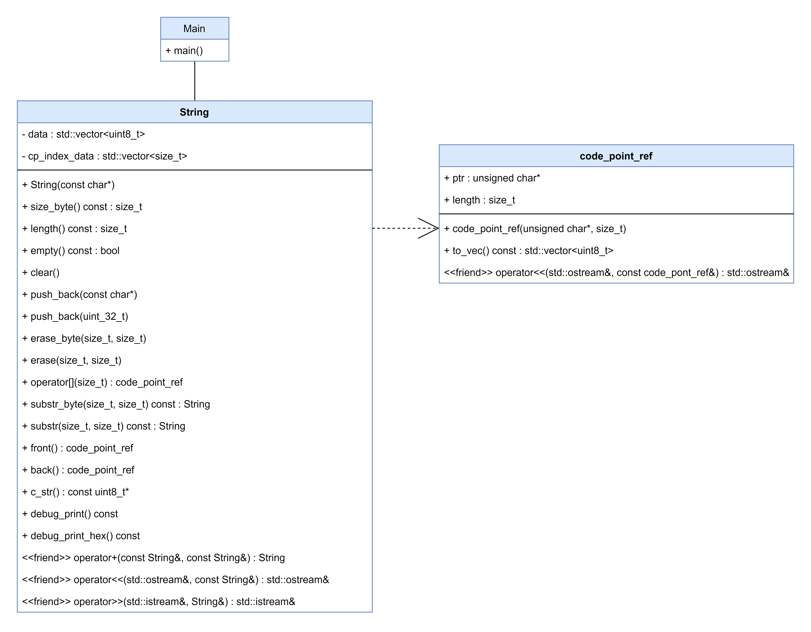

# Unicode with UTF-8: Custom string implementation
## Jan. 2024

**Overview:**
```text
Content:
+ 1. Introduction
+ 2. Unicode
    - 2.1 Introduction
    - 2.2 Code points
        - 2.2.1 Reading UTF-8 code points
        - 2.2.2 Writing UTF-8 code points
    - 2.3 Other Unicode standards
+ 3. Implementation
    - 3.1 Overview
    - 3.2 Implementation
        - 3.2.1 Indexing of code points
        - 3.2.2 Adding code points
        - 3.2.3 Null termination and c strings
        - 3.2.4 Referencing code points
+ 4. Reflection
+ 5. References
```

## 1. Introduction
The purpose of this assignment is to implement a custom string class that supports UTF-8 Unicode encoding. The learning
objectives are to learn how Unicode and UTF-8 function, and how to implement this in C++.

## 2. Unicode
### 2.1 Introduction

Unicode and UTF-8 were created to fix the limitations of ASCII, which only covered a limited set of characters
primarily used in English. ASCII encoded characters using 7 bits, allowing for 128 different characters. However, ASCII 
didn't support any special characters used in other languages, neither did it have enough bits to even support these in the first place.

Unicode solves these limitations by providing a standardized way to represent a much larger set of characters.
It does so through code points, which are unique identifiers assigned to each character within the Unicode set.

UTF-8 is a variable-length encoding scheme within the Unicode standard where each character is represented by a sequence
of up to 4 bytes. The number of bytes required for each character depends on its assigned code point.
For backwards compatibility and storage efficiency reasons, ASCII characters are still represented by a single byte
with the original ASCII identifiers. This does mean that non-ASCII characters require more than 1 byte, and are thus
at a storage space disadvantage compared to ASCII. In the worst case requiring up to 4 times as much space per character [1].

These days most platforms use UTF-8 as its character encoding standard. Below are a few examples:

- UTF-8 is the default character encoding for web development and the web in general. HTML, CSS and Javascript all support UTF-8 by default.
- Most modern databases use UTF-8 encoding to allow for a wide range of different characters to be stored and retrieved.
- Modern Linux and macOS use UTF-8 as the default encoding. Windows still uses UTF-16 internally (shame on you Microsoft).

### 2.2 Code points

In UTF-8, the encoding uses one or more bytes to represent characters. As explained in the introduction, the first
128 characters (code points 0 to 127) directly match the ASCII standard. They're therefore represented as a single
byte. All other characters use more bytes.

Below is an overview of how these bytes represent characters [3].

- Characters in the range U+0000 to U+007F (0-127) are represented using a single byte, where the most significant bit 
is always 0, and the remaining 7 bits represent the code point.

    `0ZZZZZZZ`


- Code points from U+0080 to U+07FF (128-2047) are represented using two bytes. The first byte starts with 110, 
followed by 5 bits to represent the upper bits of the code point. The second byte starts with 10 and uses 6 bits to 
represent the lower bits of the code point.`

    `110YYYYY 10ZZZZZZ`


- Code points from U+0800 to U+FFFF (2048-65535) are represented using three bytes. The first byte starts with 1110, 
followed by 4 bits to represent the upper bits of the code point. The next two bytes start with 10 and use 6 bits each 
to represent the remaining bits of the code point.

    `1110XXXX 10YYYYYY 10ZZZZZZ`

- Code points from U+10000 to U+10FFFF (65536-1,114,111) are represented using four bytes. The first byte starts with 
11110, followed by 3 bits to represent the upper bits of the code point. The next three bytes start with 10 and use 6 
bits each to represent the remaining bits of the code point.

    `11110VVV 10WWXXXX 10YYYYYY 10ZZZZZZ`

#### 2.2.1 Reading UTF-8 code points
Reading UTF-8 is simple following the above formats.
- 1 byte characters always start with a 0 (`0ZZZZZZZ`)
- 2 byte characters always start with 110 (`110YYYYY`)
- 3 byte characters always start with 1110 (`1110XXXX`)
- 4 byte characters always start with 11110 (`11110VVV`)


#### 2.2.2 Writing UTF-8 code points
The code point of a character is the hexadecimal representation of the bits that would be written into
the available spaces (V, W, X, Y, Z) within each format.

For example for the cyrillic character 'Б' with the code point "U+0411", we can determine it's represented with two bytes
since its range falls between U+00800 to U+07FF. Therefore, it is represented with two bytes in the format `110YYYYY 10ZZZZZZ`

Translating 0x0411 to binary results in 10000010001, we can now fill this in for 'Y' and 'Z'.

The resulting two bytes are then: `11010000 10010001`


### 2.3 Other Unicode standards
UTF-16 and UTF-32 are alternate encoding formats to UTF-8.

UTF-16 uses 16 bit code units, consisting of 2 bytes, to represent characters. It supports up to two code units (32 bits) per character.
Using 16 bits for each character allows for more storage efficiency for languages other than English, as each character can be
directly represented by a single 16 bit unit. Furthermore, it allows for simpler byte processing as the variable-length
encoding is slightly less complex.

UTF-32 uses 32 bit code units to represent characters. It uses a fixed length representation for each character, further
simplifying the processing and representation. It comes at the cost of consuming significantly more memory compared to
UTF-8 and UTF-16. Especially for characters that could be represented with less bytes using UTF-8 or UTF-16 [2].

## 3. Implementation
### 3.1 Overview
The program is an implementation of a standard library-style string supporting UTF-8. The _String_ class requires a 
code_point_ref struct for returning a combination of a pointer with an associated length for the full character.
This is required because a Unicode character may be more than 1 byte.


<div style="display: flex">

</div>
<div style="text-align: center;">
Figure 1: UML diagram of the program
</div>&nbsp

The string class exists out of the following two internal data structures:
- A vector (data) of `uint8_t` bytes that will contain all individual bytes in the string: `std::vector<uint8_t> data`
- A vector (cp_index_data) that sequentially indexes the first byte of each code point inside the data vector: `std::map<size_t, size_t> cp_index_map{}`

The cp_index_data vector is built from the contents of `data` each time it is updated.

The code_pont_ref struct saves information required to properly work with code points. It includes:
- A pointer to the first byte of a code point
- The length of the code point in bytes
It also includes a function `to_vec()` to return a vector with the contents of this pointer and length. Lastly, it has
compatibility with the stream operator<< to allow for easy printing using std::cout.

### 3.2 Core concepts

#### 3.2.1 Indexing of code points

Since UTF-8 characters are variable-length bytes of data put into the data vector `data`, we have no idea where
to index in this vector if we, for example, want to retrieve the second character of a string.

To keep track of this, a second vector `cp_index_data` saves the first byte of each code point in the `data` vector
sequentially, just like a normal ASCII vector. This way the 3rd element in this `cp_index_data` vector also points to
the first byte of the third character in the string.

This `cp_index_data` vector is updated any time the `data` vector is updated. We do this by calling the `update_cp_index_vector()`
function any time the string is modified.

This function will scan through the current contents of `data` using the method outlined in **_2.2.1 Reading UTF-8 code points_** to detect
the starting combination and length of the individual code points. The first byte of the code point is added to `cp_index_data` and the length
is used to skip the remaining bytes of that code point.

```c++
    void String::update_cp_index_vector() {
        // Scan through the vector, detect the code_points, update the cp_index_data with the data_index
        // data_index: index of the first byte of a codepoint in the cp_index_data vector

        // Clear the current cp_index_data vector
        cp_index_data.clear();

        // Scan through the data vector, find the codepoints and add them to the cp_index_data vector
        for (size_t data_index = 0; data_index < data.size();) {
            /* Check how many bytes the character is by checking the marker bits in the first byte */

            auto cp_length = get_codepoint_length(data[data_index]);

            if (cp_length == 1) {
                // If the most significant bit is 0 it's a single-byte character
                cp_index_data.push_back(data_index);
                data_index++;
            } else if (cp_length == 2) {
                // If the 3 most significant bits are 110, then 2 byte character
                cp_index_data.push_back(data_index);
                data_index += 2;
            } else if (cp_length == 3) {
                // If the 4 most significant bits are 1110, then 3 byte character
                cp_index_data.push_back(data_index);
                data_index += 3;
            } else if (cp_length == 4) {
                // If the 5 most significant bits are 11110, then 4 byte character
                cp_index_data.push_back(data_index);
                data_index += 4;
            } else {
                data_index++;
            }
        }
    }
```

Below is the implementation of `get_codepoint_length`, which implements the method outlined in **_2.2.1 Reading UTF-8 code points_** to detect
the number of bytes in a code point character.

```c++
    size_t String::get_codepoint_length(uint8_t first_byte) const {
        /* Check how many bytes the character is by checking the marker bits in the first byte */
        if ((first_byte & 0b10000000) == 0b00000000) {
            // If the most significant bit is 0 it's a single-byte character
            return 1;
        } else if ((first_byte & 0b11100000) == 0b11000000) {
            // If the 3 most significant bits are 110, then 2 byte character
            return 2;
        } else if ((first_byte & 0b11110000) == 0b11100000) {
            // If the 4 most significant bits are 1110, then 3 byte character
            return 3;
        } else if ((first_byte & 0b11111000) == 0b11110000) {
            // If the 5 most significant bits are 11110, then 4 byte character
            return 4;
        } else {
            // Invalid UTF-8 sequence
            return 0;
        }
    }
}
```


#### 3.2.2 Adding code points

However, to index code points we must also be able to add them. Simply passing a string of unicode characters
will by default add the correct bytes already. 

Example: `str.push_back("♫♫♫");`

```c++
    void String::push_back(const char *str) {
        while (*str) {
            data_push_back_null(static_cast<uint8_t>(*str));
            ++str;
        }

        update_cp_index_vector();
    }
```
This works fine and pushes the correct bytes into our string. This can now also be implemented in a constructor.

But what if we want to pass the code point directly in a hexadecimal form?

Example: `str.push_back(0x6C34); // Code point for '水'`

In this case we can use the method previously explained in **_2.2.2 Writing UTF-8 code points_**.
We check which UTF-8 range this code point falls into, and push the bits in their correct place using bitshifting and masking.

```c++
    void utf_str::String::push_back(uint32_t code_point) {
        // Extracts bits from code_point and constructs the bytes according to the UTF-8 encoding rules

        /* * * * * * * * * * * * * * * * * * * * * * * * *
         * 1 byte  : 0ZZZZZZZ
         * 2 bytes : 110YYYYY 10ZZZZZZ
         * 3 bytes : 1110XXXX 10YYYYYY 10ZZZZZZ
         * 4 bytes : 11110VVV 10WWXXXX 10YYYYYY 10ZZZZZZ
         * * * * * * * * * * * * * * * * * * * * * * * * */

        if (code_point <= 0x7F) {
            // If in the range U+0000 to U+007F (ascii), use 1 byte
            data_push_back_null(static_cast<uint8_t>(code_point)); // push byte
        } else if (code_point <= 0x7FF) {
            // If in the range U+0080 to U+07FF, use 2 bytes
            data_push_back_null(static_cast<uint8_t>(0b11000000 | ( code_point  >> 6)));
            data_push_back_null(static_cast<uint8_t>(0b10000000 | ( code_point           & 0b00111111)));
        } else if (code_point <= 0xFFFF) {
            // If in the range U+0800 to U+FFFF, use 3 bytes
            data_push_back_null(static_cast<uint8_t>(0b11100000 | ( code_point >> 12)));
            data_push_back_null(static_cast<uint8_t>(0b10000000 | ((code_point >> 6 )    & 0b00111111)));
            data_push_back_null(static_cast<uint8_t>(0b10000000 | ( code_point           & 0b00111111)));
        } else if (code_point <= 0x10FFFF) {
            // If in the range U+10000 to U+10FFFF, use 4 bytes
            data_push_back_null(static_cast<uint8_t>(0b11110000 | ( code_point >> 18)));
            data_push_back_null(static_cast<uint8_t>(0b10000000 | ((code_point >> 12)    & 0b00111111)));
            data_push_back_null(static_cast<uint8_t>(0b10000000 | ((code_point >> 6 )    & 0b00111111)));
            data_push_back_null(static_cast<uint8_t>(0b10000000 | ( code_point           & 0b00111111)));
        } else {
            throw std::invalid_argument("Invalid unicode code point");
        }

        update_cp_index_vector();
    }
```

#### 3.2.3 Null termination and c strings

You might've noticed the function `data_push_back_null` in the above examples. This is simply a push_back for the `data` 
vector that ensures a null terminator is always at the end of the vector.

```c++
    void String::data_push_back_null(uint8_t c) {
        // Ensures that the last character is always '\0'
        if (!data.empty() && data.back() == '\0') {
            // If the last element is '\0' replace it with the new character
            data.back() = c;
            data.push_back('\0');
        } else {
            // If empty, push the data and push '\0' behind it.
            data.push_back(c);
            data.push_back('\0');
        }
    }
```

By adding a null terminator we can treat the contents of the string (contents of `data`) as any other C string.
In order to make full use of this, there is a `c_str()` function that returns a pointer to the first byte of the string.
```c++
    const uint8_t *String::c_str() const {
        // Returns pointer to the underlying character storage.
        if (data.empty()) {
            return nullptr;
        }

        return &data[0];
    }
```

We can now print the contents of a string using `std::cout`

```c++
    utf_str::String words_of_wisdom{"利纳克斯"};
    std::cout << words_of_wisdom.c_str();
    
    output: 利纳克斯
```

Further support for printing and manipulating the contents of the String were added with the implementation of overloads 
for the stream operators `operator<<` and `operator>>`.

Important to note is that the null terminator does cause headaches. Since we don't want it to affect functions such as
`size_byte()` which returns the size of the string in bytes, or `length()` which returns the length of the string
in code points, we need to compensate for the existence of a null terminator here.


#### 3.2.4 Referencing code points

Another issue with having variable-width characters is returning references. Take `operator[]` for example.  For this
function we want to return a reference to the character at the passed index. But how do we return a reference to
a variable number of bytes?

For this the `code_point_ref` struct is used.

```c++
    struct code_point_ref {
        code_point_ref(unsigned char* ptr, size_t length);
        unsigned char *ptr{}; // Pointer to the first byte of the code_point
        size_t length{}; // Length in bytes of code point

        std::vector<uint8_t> to_vec() const; // Convert pointer and its length to a vector with the codepoint's contents
        friend std::ostream& operator<<(std::ostream& os, const code_point_ref& cp_ref);
    };
```

The struct contains a pointer to the first byte of the code point and a length of the code point in bytes. These
are used in functions such as `front()` and `back()` which return code_point_refs to the first character or last character
(excluding null terminator) respectively.

We can now use this struct to implement `operator[]`.
```c++
    code_point_ref String::operator[](size_t cp_index) {

        if (cp_index >= this->length()) { // because [0] is the 1st element, so 4 elements (size of 4) means max [3]
            throw std::out_of_range("Index out of bounds");
        } else {
            auto cp_length = get_codepoint_length(data[cp_index]);

            return code_point_ref{&data[cp_index_data[cp_index]], cp_length};
        }

    }
```


These functions form the core concepts of the class. There are a bunch of other functions implemented, such as:
- `erase_byte`: Erases bytes from index start to count
- `erase`: Erasse codepoint characters from index start to count.
- `subtr_byte`: Return substring from byte index start to count
- `subtr`: Return substring from code point character index start to count
- `operator+`: Concatenate 2 strings

The specific implementation of these functions can be found in the code.

## 5. References
 - [1] Studying With Alex. _Unicode, in friendly terms: ASCII, UTF-8, code points, character encodings, and more_. 
https://www.youtube.com/watch?v=ut74oHojxqo, accessed 16 Dec 2023.
 - [2] GeeksforGeeks. *Understanding Character Encoding*. "https://www.geeksforgeeks.org/understanding-character-encoding/", accessed 21 Dec. 2023.
 - [3] Jakov Jenkov. *UTF-8*. "https://jenkov.com/tutorials/unicode/utf-8.html", accessed 22 Dec 2023.

